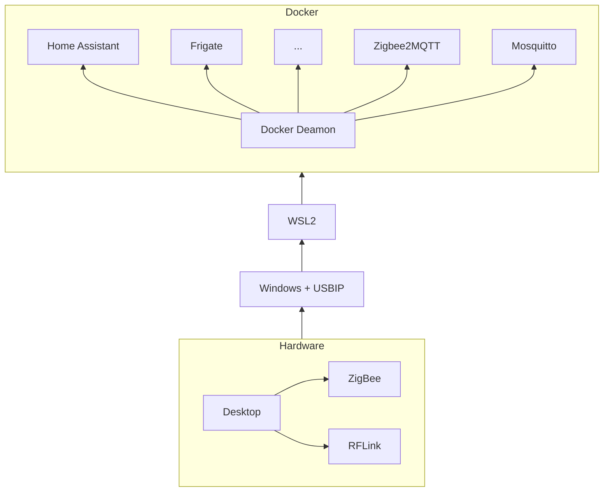

> This page is WIP - as I progress through the journey, I'll update my notes and this page will be refreshed a couple minutes later

# How to migrate a docker compose file to Docker Swarm Mode?
...from `docker compose up -d` to `docker stack deploy --compose-file docker-compose.yaml ha`

## 0. Backstory: Home Assistant in a container

Boring story, for context:

>*After installing a PKI and OpenVPN manually on a Raspberry Pi 4, I've been wanting a more flexible way to install/remove/update stuff on it... Containers looked like the way to go... but what if I want to run many things? That'd be fun to have a cluster of Raspberry Pi... which led me to find the Turing Pi 2 cluster board. And as I researched what people usually deploy on Raspberry clusters, I kept seeing the Home Assistant logo...*

>*So I looked at it up close and started running a Home Assistant instance.
While waiting for the Turing Pi 2 to release, I thought I would run the containers directly on my desktop using Docker Compose. And if I did it right, I would "just" have to move my containers to the new hardware once ready, right?... well that takes a couple precautions*

### A first docker compose, running on windows / docker desktop 

So I started creating a docker compose file, with just Home Assistant to begin with.
Simple container, local bind
Adding USB... Leading to USBIP
Then needing to install a distro in the WSL2 (why?)

- Update the WSL
wsl --update
- Set it to WSL 2
wsl --set-default-version 2
- Install a distro, eg Ubuntu LTS
https://aka.ms/wslubuntu2204

### Adding more container to compose... and more complexity

??? bug "TODO" 
    Architecture diagramme

    Specific features used





### Thinking of the migration to a cluster... (too soon to dive in this?)

Will have to install docker and configure many compute modules. Don't really want to do that manually and miss anything... Here comes Ansible 
??? bug "TODO"
    Ansible for setting up the Swarm Mode
My playbook is based on Jeff Geerling's Turing Pi 2, where I swapped K3s for Docker Swarm Mode: https://github.com/geerlingguy/turing-pi-2-cluster

## 1. Looking at Swarm Mode: many questions came up...

Questions I had when thinking of the migration to Swarm Mode:
- how to deploy a **compose file** in swarm mode?
- how to access **bound folders** in swarm mode?
- how to access **USB devices** in swarm mode?
- how to **restart** malfunctioning containers/services? (like self-healing from k8s)

Didn't find very direct answers so I digged up a bit more...

### What needs to be changed in my compose file to migrate so swarm mode?

Impact of swarm mode on usual sections from compose
This is not a comprehensive list (refer to the compose reference for that), but that's all the things I had to tinker with in my compose file to make it swarm friendly:

- ``privileged: true`` 
    - Ignored in swarm. You should not need it 
- ``restart: always``
    - Ignored in Swarm. Not an issue as swarm services will be destroyed / recreated as necessary (to reach the constraints)
- ``container_name:`` 
    - Ignored in swarm. Doesn't really matter anyway?
- ``device:`` 
    - Ignored in swarm. Ok this one is an issue, particularly with our USB devices needed to communicate with the real world (Zigbee bridge, RFlink or Coral accelerator etc.)
- ``volume / binds (inline):`` 
    - Similar to the USB devices, you can't mount bind on a node, while services are moving potentially on any node of the cluster.
- ``shm_size:``
    - https://docs.frigate.video/installation/#calculating-required-shm-size
    ??? bug "TODO"
        what impacts on Frigate --> workaround with a volume tmpfs targeted to /dev/shm

### How to pass devices in Swarm Mode?

Two things to deal with:

1. By construction, services in a swarm can be run on any node... which will not work if we need to access a specific USB device. Can't wait to be lucky and be on the right node
    - For this we are going to use the swarm specific section "deploy" to indicate a constraints for the service needing the USB device.
    
    ??? bug "TODO"
        Example of deploy section


2. Even on the right node, how can we pass the USB device... without the "device" section?
    - This one is trickier, we have to pass the device as a **volume**, and manually authorise the device for the container using a number of scripts

3. Cgroups v1 vs v2
    - Work in WSL as still v1...
    - To know:
      - ``stat -fc %T /sys/fs/cgroup/``
        For cgroup v2, the output is ``cgroup2fs``.
        For cgroup v1, the output is ``tmpfs``.
    - For 2 to work on modern systems (eg. rasp / modern linux): mount v1 device? 
    - sudo mkdir /sys/fs/cgroup/devices
    - sudo mount -t cgroup -o devices none /sys/fs/cgroup/devices


#### Create rules to mount the device as a volume
The idea is as follows:

1. The UDEV rule detects a USB device with a given vendor id and product id, then assigns it a name (symlink) and runs a 'docker-setup-*device*.sh' shell script.
2. The 'docker-setup-*device*.sh' script finds the CID of a given container, by name and adds the authorisations for the USB device to the devices.allow file for this container.
   1. Device access authorisations are hardcoded for the Coral to ``c 189:* rwm`` because it changes vendor and product id after first inference (ie the USB device is different when you plug it and after first access)
3. The service makes sure the script in 2. is executed regularly (because the UDEV rule is only activated when the USB device is plugged)
4. A script is run by the service, to loop-execute the script in 2.

Example with my zigbee USB stick

1. UDEV rule: `/etc/udev/rules.d/99-zigbee.rules`

    ``` sh title="99-zigbee.rules"
    SUBSYSTEM=="tty", ATTRS{idVendor}=="10c4", ATTRS{idProduct}=="ea60", SYMLINK+="zigbee",  RUN+="/usr/local/bin/docker-setup-zigbee.sh"
    ```

2. Shell script to set up the permissions: `/usr/local/bin/docker-setup-zigbee.sh`

    ``` shell title="docker-setup-zigbee.sh"
    #!/bin/bash
    USBDEV=`readlink -f /dev/zigbee` # (1)!
    read minor major < <(stat -c '%T %t' $USBDEV)
    if [[ -z $minor || -z $major ]]; then
      echo 'Device not found'
      exit
    fi
    dminor=$((0x${minor}))
    dmajor=$((0x${major}))
    CID=`docker ps -a --no-trunc | grep zigbee2mqtt | head -1 |  awk '{print $1}'` # (2)!
    if [[ -z $CID ]]; then
      echo 'CID not found'
      exit
    fi
    echo 'Setting permissions'
    echo "c $dmajor:$dminor rwm" > /sys/fs/cgroup/devices/docker/$CID/devices.allow
    ```

    1. Change the name of the device, `zigbee` (to be the same as the SYMLINK name in the UDEV rule in previous step)
    2. Change the name of the container that needs access to the device, `zigbee2mqtt` in this example

3. Service to launch the setup script all the time: ``/etc/systemd/system/docker-event-listener-zigbee.service``

    ``` ini title="docker-event-listener-zigbee.service"
    [Unit]
    Description=Docker Event Listener for USB devices
    After=network.target
    StartLimitIntervalSec=0
    [Service]
    Type=simple
    Restart=always
    RestartSec=1
    User=root
    ExecStart=/bin/bash /usr/local/bin/docker-event-listener-zigbee.sh

    [Install]
    WantedBy=multi-user.target
    ```

4. Script triggered by the service: ``/usr/local/bin/docker-event-listener-zigbee.sh``

    ```shell title="docker-event-listener-zigbee.sh"
    #!/bin/bash
    docker events --filter 'event=start'| \
    while read line; do
      /usr/local/bin/docker-setup-zigbee.sh
    done
    ```

Source and more details: https://github.com/Koenkk/zigbee2mqtt/issues/2049

### Volumes and storage

[Volumes in swarm](https://stackoverflow.com/questions/55288453/docker-volume-in-swarm)

>A volume is a way for docker to describe a mount point. When a volume get created, it doesn't actually get physically mounted anywhere until a container needs it.
>So if you have a docker swarm and multiple nodes, when you create a volume, essentially the description of the volume gets replicated on each nodes but nothing else happens.
>When a container boot up, it will try to mount a volume on the host its being booted up. If the volume wasn't physically present it will get mounted/created for the first time and reused there. So if you're using the local driver, it will essentially create the folder and that's it.
>If you have multiple hosts, it means each host will create its own folder on demand.

  - TODO: use NFS volumes

## Carve out portainer from the compose file

Portainer is used as a spring board and will be run on the master node automatically 
The single service "portainer" compose file also creates the custom overlay network for others services to join

From portainer, the rest of the previous compose, now stack, will be launched. A template is created to recreate/launch easily.
Doing it from portainer allows to control the stack from the web

## Update access to node-red files

[From 'Running under Docker' (node-red doc)](https://nodered.org/docs/getting-started/docker)

> Note: Users migrating from version 0.20 to 1.0 will need to ensure that any existing /data directory has the correct ownership. As of 1.0 this needs to be 1000:1000. This can be forced by the command `sudo chown -R 1000:1000 path/to/your/node-red/data`

In my case, on my storage node, I ran:
```
sudo chown -R 1000:1000 /zfsdata/nfsshare/HomeAssistant/node-red
```

## Hardware acceleration on Rasp pi4

Linux Kernel bug fixed in July 2023 -- but sadly doesn't really impact the ffmpeg default processing... mostly for the object recognition... 

## ESPHome sees all devices offline?

This is due to ESPHome not resolving the device-name.local names to IP address (via mDNS).

I've used a workaround for some time, by adding the following parameters to the ESPHome Docker service in docker-compose.yaml:
```yaml
    extra_hosts:
      - "ep1.local:<IP of the device>"
      - "home-assistant-glow.local:<IP of the device>"
```

My "fix" has been to repack the ESPHome image and adding avahi-utils to it, and allowing the container to access the dbus and avahi socket of the host (the host resolved the *.local properly).

To do that, I'm using the following dockerfile (image published in docker hub [poulti/esphome-avahi](https://hub.docker.com/r/poulti/esphome-avahi)):
```Dockerfile title="Dockerfile"
FROM esphome/esphome:latest

# Install Avahi for mDNS (resolving .local names)
RUN apt-get update && apt-get install avahi-utils -y

# Remove apt cache (from https://docs.docker.com/develop/develop-images/dockerfile_best-practices/)
RUN rm -rf /var/lib/apt/lists/*
```

And I added the following volumes to the ESPHome Docker service in docker-compose.yaml:
```yaml
    volumes:
      (...)
      # Added Avahi deamon socket to run avahi-browse using the cache from the host node
      - /var/run/dbus:/var/run/dbus
      - /var/run/avahi-daemon/socket:/var/run/avahi-daemon/socket
```


## Notes for later - migration steps on D-day

- [ ] Flash 2x raspberry emmc
- [ ] Flash 1x micro sd card raspberry 
- [ ] Flash 1x micro sd card Jetson
- [ ] Install components in box
- [ ] Plug Pi, Jetson, harddrives
- [ ] Test boot OK
- [ ] Run first Ansible ping / accept SSH keys
- [ ] Configure USB2 to the right node
- [ ] Check Ansible config.yml for correct true/false settings
- [ ] Test Ansible setup playbooks (swarm activation + NFS setup)
- [ ] Copy data on NFS storage
- [ ] Change Docker Volumes to NFS binds
- [ ] Change Frigate image to the right CPU arch type
- [ ] Connect USB devices to the right USB
- [ ] Change the port forwarding from external IP

## 2. How to actually use the updated compose file in Swarm Mode? Testing...

Can actually switch to swarm, test deploying a stack -- and if it doesn't work, remove it and put your compose back up. No need to exit/delete the swarm

- Comment the network part of docker compose file
- Then:
  ```
  docker stack deploy --compose-file docker-compose.yaml homeassistant
  ```
- At the end:
  ```
  docker stack rm homeassistant
  ```
- Uncomment the network section

### Test image

<figure markdown>

{ width="300" }
<figcaption markdown> Diablo IV Early access Wiz. </figcaption>

</figure>