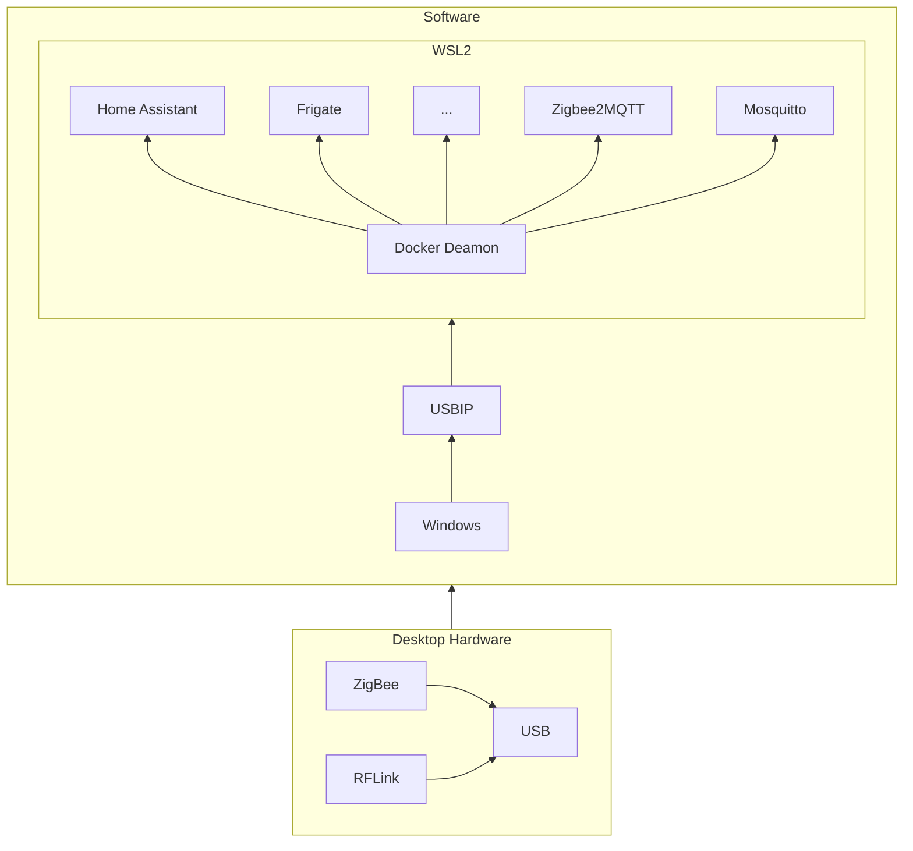

> This page is WIP - as I progress through the journey, I'll update my notes and this page will be refreshed a couple minutes later

# How to migrate a docker compose file to Docker Swarm Mode?
...from `docker compose up -d` to `docker stack deploy --compose-file docker-compose.yaml ha`

## 0. Backstory: Home Assistant in a container

How did it start... for context:

>*Like a good chunk of 30yo+, I bought a (couple of) Raspberry without knowing what to do with it...*

>*After installing a PKI and OpenVPN manually on a Raspberry Pi 4 (and that's a lot of commands), I've been wanting a more flexible way to install/remove/update stuff on it - particularly because I hate having apps installed directly on the OS, and the thought of needing to reinstall and configure everything should I need to replace/upgrade the hardware. Enter **containers**: a packaged system/app I can deploy with 1 action/no install, and when it stops, it (almost) doesn't leave anything to clean up.

> *But what if I want to run more things? and being resilient to the raspberry or sd card dying? That'd be fun to have a cluster of Raspberry Pi... which led me to find the Turing Pi 2 cluster board. And as I researched what people usually deploy on Raspberry clusters, I kept seeing the Home Assistant logo...*

>*So I looked at it up close while waiting for the Turing Pi 2 to release - I thought I would run the containers directly on my desktop using Docker Compose. And if I did it right, I would "just" have to move my containers to the new hardware once ready, right?... well, not that simple unfortunately...*

>*This page is the combined notes going through that journey, because for many topics I struggled to find clarity, I thought I'd make this public. I'm not a professional blogger so please excuse the clunky style - just hope it is useful to someone somewhere!*

### A first docker compose, running on windows / docker desktop 

So I started creating a docker compose file to run on Docker for Windows, with just Home Assistant to begin with. That's pretty simple at that stage, you can find examples of docker compose file on the official website.
Below is the simplified copy of one of the first compose file:

```yaml
version: '3.9'

services:
  homeassistant:
    container_name: homeassistant
    hostname: homeassistant
    image: "ghcr.io/home-assistant/home-assistant:stable"
    restart: always
    ports:
      - "8123:8123/tcp"
    environment:
      - TZ=Europe/London
    volumes:
      - hass-config:/config
      - /etc/localtime:/etc/localtime:ro

volumes:
  hass-config:
    driver: local
    driver_opts:
      type: none
      device: D:\HomeAssistant\hass\config
      o: bind
```

> Here are the main things to know about the sections of a docker compose file:
>
>- ``services``: this where you declare the "machine" (container) and detail settings 
>
>- ``volumes``: this is the configuration of storage volumes for the container. The point is to store your custom config for the machine outside the container, to be able to back it up and restart the container in the same state.
  >* In this Windows hosted container, I configured the storage to map (bind) the volume named `hass-config` to a local folder on my Windows machine, at ``D:\HomeAssistant\hass\config``

...but the point is to automate and control "things" remotely, so I added a Zigbee controller, buying a £15 Zonoff USB Zigbee dongle on Amazon. To make it work, decided to use zigbee2mqtt as the service to connect with it, and hence I needed an MQTT server (eg mosquitto) in between home assistant and zigbee2mqtt.
MQTT is a communication protocol commonly used in industrial environment. Here, it's used to link the ZigBee receiver, and Home Assistant.

Updated docker compose looked like this:

```yaml
version: '3.9'

services:
  homeassistant:
    container_name: homeassistant
    hostname: homeassistant
    image: "ghcr.io/home-assistant/home-assistant:stable"
    restart: always
    ports:
      - "8123:8123/tcp"
    environment:
      - TZ=Europe/London
    volumes:
      - hass-config:/config
      - /etc/localtime:/etc/localtime:ro

  mosquitto:
    container_name: mosquitto
    hostname: mosquitto
    image: eclipse-mosquitto
    restart: always
    ports:
      - 1883:1883
      - 9001:9001
    environment:
      - TZ=Europe/London
    volumes:
      - mosquitto-config:/mosquitto:rw

  zigbee2mqtt:
    container_name: zigbee2mqtt
    hostname: zigbee2mqtt
    image: koenkk/zigbee2mqtt
    restart: always
    ports:
      - 8080:8080
    environment:
      - TZ=Europe/London
    volumes:
      - zigbee2mqtt-data:/app/data
    devices:
      - /dev/ttyUSB0:/dev/zigbee


volumes:
  hass-config:
    driver: local
    driver_opts:
      type: none
      device: D:\HomeAssistant\hass\config
      o: bind
  mosquitto-config:
    driver: local
    driver_opts:
      type: none
      device: D:\HomeAssistant\mosquitto
      o: bind
  zigbee2mqtt-data:
    driver: local
    driver_opts:
      type: none
      device: D:\HomeAssistant\zigbee2mqtt-data
      o: bind
```

Notice the addition of the USB device used by Zigbee2MQTT container?
```yaml
  zigbee2mqtt:
  (...)
    devices:
      - /dev/ttyUSB0:/dev/zigbee
```

As the containers are actually run in Windows Subsystem for Linux (aka WSL, a linux environment in Windows OS) the ``devices`` reference above needs to give the path to a USB device known to the WSL... so how do you get a USB device connected to your Windows machine, to the WSL?

Enters USBIP-WIN: "Windows software for sharing locally connected USB devices to other machines, including Hyper-V guests and WSL 2." according to [its github](https://github.com/dorssel/usbipd-win).

Wait, it says "WSL 2"? By default, Windows uses WSL "1", so you'll find below how to switch to WSL 2 and install a linux distribution in it. Here are some of notes on the process:

- In BIOS, turn on VT-x
- In a cmd or powershell run as admin:
  ```
  wsl --install
  ```
- Reboot
- Update the WSL
  ```
  wsl --update
  ```
- Set it to WSL 2
  ```
  wsl --set-default-version 2
  ```
- Download a distro, eg Ubuntu 22.04 LTS, go to https://aka.ms/wslubuntu2204
(Go to Microsoft Store app, and search Ubuntu, download), and open the .appbundle
- Install the distro (not sure that step is necessary anymore if you opened the appbundle in the UI): 
  ```
  wsl --install -d ubuntu
  ```

Then follow the steps to install USBIP-WIN from the github above.

At that stage you have the foundation of home assistant and docker services, and ZigBee network connected. Time to expand to even more services!

### Adding more container to compose... and more complexity

From here, everything is possible - without a specific order, you can add a variety of things:

- An RFlink device (USB) to access weather stations signals (radio frequencies on 433MHz)
- A back up service for the whole configuration (eg. duplicati)
- A reverse proxy for external access (Traefik or nginx)
- A Network Video Recording (Frigate) to manage cameras
...


For example, leading to a structure like this:




### Thinking of the migration to a cluster... (Docker Swarm)

From here, I still didn't have my Turing Pi and many nodes, but I wanted to get ready for it. 
Actually, quick research taught me it's possible to run the same containers in Swarm mode on 1 node.
Docker Swarm mode is designed to manage multiple machines (called nodes) each having their own docker instance, and distributing the containers between the machines. So it actually works with only 1 machine, but you don't get the redundancy of multiple node of course.
The other good news is the switch to Swarm Mode (in Docker) is reversible: you can switch to Swarm Mode (with one machine) and "exit" Swarm Mode to return to the "normal" compose file reference - so you don't risk much in preparing files/config for Swarm. And you'll see later that you can leave your Swarm Mode on and still "compose up" on the same machine.

### Looking at Swarm Mode: what changes vs Compose?

A couple of questions came up when thinking of the migration to Swarm Mode:

- How to deploy a **compose file** in swarm mode?
- How to access **bound folders** in swarm mode?
- How to access **USB devices** in swarm mode?
- How to **restart** malfunctioning containers/services? (like self-healing from k8s)

Let's go through these questions one by one


## 1. How to deploy a **compose file** in swarm mode?

Before switching to the cluster, you can test the updated compose file for Swarm Mode, by deploying the stack on a Swarm of 1 node. And if it doesn't work, remove the stack and compose up instead. No need to exit/delete the swarm to use the regular compose up.

- To deploy the compose file on a Swarm:
  ```
  docker stack deploy --compose-file docker-compose.yaml homeassistant
  ```

...and once finished

- To stop it:
  ```
  docker stack rm homeassistant
  ```

### ...but the compose file doesn't work AS-IS in Swarm Mode! What needs to be changed to work with Swarm Mode?

Docker compose reference is slightly different for swarm mode, i.e. some keywords are ignored or not working in swarm mode.

This is not a comprehensive list (refer to the compose reference for that), but that's all the things I had to tinker with in my compose file to make it swarm friendly:

- ``privileged: true`` 
    - Ignored in swarm. You should not need it 
- ``restart: always``
    - Ignored in Swarm. Not an issue as swarm services will be destroyed / recreated as necessary (to reach the constraints)
- ``container_name:`` 
    - Ignored in swarm. Doesn't really matter anyway?
- ``volume / binds (inline):`` 
    - Similar to the USB devices, you can't mount bind on a node, while services are moving potentially on any node of the cluster.
- ``device:`` 
    - Ignored in swarm. Ok this one is an issue, particularly with our USB devices needed to communicate with the real world (Zigbee bridge, RFlink or Coral accelerator etc.)
- ``shm_size:``
    - https://docs.frigate.video/installation/#calculating-required-shm-size
    ??? bug "TODO"
        what impacts on Frigate --> workaround with a volume tmpfs targeted to /dev/shm
```yaml
services:
(...)
  frigate:
  (...)
    volume:
    (...)
      - type: tmpfs # Optional: 1GB of memory, reduces SSD/SD Card wear
        target: /tmp/cache
        tmpfs:
          size: 1000000000
    # shm_size: "190mb" # update for your cameras based on calculation below (each Tapo is ~27mb and G4 is ~53mb)
    # (width * height * 1.5 * 9 + 270480)/1048576 = <shm size in mb> for each camera
    # The below volume replaces shm_size for swarm mode
      - type: tmpfs
        target: /dev/shm
        tmpfs:
           size: 190000000 # (this means 190mb)
```

The next sections focus on the volume / folders access in swarm, then on how to passe a USB device.

## 2. How to access **bound folders** in swarm mode? (Volumes and storage)

In swarm mode, you can't bind a local folder, because you can't predict on which node a given container will be located. You could force the assignment of a container to a given node with docker constraints and labels, but that would defeat the purpose of running a cluster (ie. having container able to move around based on the availability of the underlying machines (node)).

I found two approaches that seem to mitigate this:

- Have a filesystem that replicates the content over all nodes (ie. each Raspberry Pi or RK1 modules would have a copy of the entire dataset). Sounds great for data access performance, but obviously it requires enough space on each node and as the lab grows up, will it scale on those poor little 32GB sd cards? Just that idea stopped me from exploring this option further.
- Or access the data from a network share - which means having all the date in 1 place (one node, or somewhere else...), open it to be shared on the network (eg. NFS) and access it from the nodes. One way to configure this on the container side is to use volumes, see below the description

[Volumes in swarm](https://stackoverflow.com/questions/55288453/docker-volume-in-swarm)

>A volume is a way for docker to describe a mount point. When a volume get created, it doesn't actually get physically mounted anywhere until a container needs it.
>So if you have a docker swarm and multiple nodes, when you create a volume, essentially the description of the volume gets replicated on each nodes but nothing else happens.
>When a container boot up, it will try to mount a volume on the host its being booted up. If the volume wasn't physically present it will get mounted/created for the first time and reused there. So if you're using the local driver, it will essentially create the folder and that's it.
>If you have multiple hosts, it means each host will create its own folder on demand.

Practically, I would use volumes in the compose file (which was already the case) and replace the "bound" volumes with NFS ones

For instance, the first volume in the compose file was:
```yaml
(...)
volumes:
  hass-config:
    driver: local
    driver_opts:
      type: none
      device: D:\HomeAssistant\hass\config
      o: bind
(...)
```
...and would now look something like:
```yaml
(...)
volumes:
  hass-config:
    driver: local
    driver_opts:
      type: nfs4
      o: nfsvers=4,addr=<IP-OF-THE-NFS-SERVER>,nolock,rw,sync
      device: ":/<nfssharepath>/HomeAssistant/hass/config"
(...)
```

## 3. How to access **USB devices** in swarm mode?

Couple things to deal with:

1. Problem: by construction, services in a swarm can be run on any node... which will not work if we need to access a specific USB device plugged into it. Can't wait to be lucky and be on the right node...
  Solution:
    - For this we are going to use the swarm specific section "deploy" to indicate a constraints (=rule) for the service needing the USB device. It requires "tagging" the node with labels in the first place, then using docker deploy constraints. 
    - In the example below, the constraint says the node should have a label named "usb2" with a value equal to "true".
    ```yaml
    services:
        myService:
            image: (...)
            (...)        
            deploy:
                placement:
                    constraints: [node.labels.usb2 == true]
                replicas: 1
    ```
      - Btw, adding such a label to a node is achieved by executing the following command on a manager node:
        ```sh
        docker node update --label-add usb2=true <name of the node>
        ```

2. Even on the right node, how can we pass the USB device... without the "device" section?
    - This one is trickier, we have to pass the device as a **volume**, and manually authorise the device for the container using a number of scripts

3. Cgroups v1 vs v2
    - Work in WSL as still v1...
    - To know:
      - ``stat -fc %T /sys/fs/cgroup/``
        For cgroup v2, the output is ``cgroup2fs``.
        For cgroup v1, the output is ``tmpfs``.
    - For 2 to work on modern systems (eg. rasp / modern linux): mount v1 device? 
    - sudo mkdir /sys/fs/cgroup/devices
    - sudo mount -t cgroup -o devices none /sys/fs/cgroup/devices


### Create rules to mount the device as a volume
The idea is as follows:

1. The UDEV rule detects a USB device with a given vendor id and product id, then assigns it a name (symlink) and runs a 'docker-setup-*device*.sh' shell script.
2. The 'docker-setup-*device*.sh' script finds the CID of a given container, by name and adds the authorisations for the USB device to the devices.allow file for this container.
   1. Device access authorisations are hardcoded for the Coral to ``c 189:* rwm`` because it changes vendor and product id after first inference (ie the USB device is different when you plug it and after first access)
3. The service makes sure the script in 2. is executed regularly (because the UDEV rule is only activated when the USB device is plugged)
4. A script is run by the service, to loop-execute the script in 2.

Example with my zigbee USB stick

1. UDEV rule: `/etc/udev/rules.d/99-zigbee.rules`

    ``` sh title="99-zigbee.rules"
    SUBSYSTEM=="tty", ATTRS{idVendor}=="10c4", ATTRS{idProduct}=="ea60", SYMLINK+="zigbee",  RUN+="/usr/local/bin/docker-setup-zigbee.sh"
    ```

2. Shell script to set up the permissions: `/usr/local/bin/docker-setup-zigbee.sh`

    ``` shell title="docker-setup-zigbee.sh"
    #!/bin/bash
    USBDEV=`readlink -f /dev/zigbee` # (1)!
    read minor major < <(stat -c '%T %t' $USBDEV)
    if [[ -z $minor || -z $major ]]; then
      echo 'Device not found'
      exit
    fi
    dminor=$((0x${minor}))
    dmajor=$((0x${major}))
    CID=`docker ps -a --no-trunc | grep zigbee2mqtt | head -1 |  awk '{print $1}'` # (2)!
    if [[ -z $CID ]]; then
      echo 'CID not found'
      exit
    fi
    echo 'Setting permissions'
    echo "c $dmajor:$dminor rwm" > /sys/fs/cgroup/devices/docker/$CID/devices.allow
    ```

    1. Change the name of the device, `zigbee` (to be the same as the SYMLINK name in the UDEV rule in previous step)
    2. Change the name of the container that needs access to the device, `zigbee2mqtt` in this example

3. Service to launch the setup script all the time: ``/etc/systemd/system/docker-event-listener-zigbee.service``

    ``` ini title="docker-event-listener-zigbee.service"
    [Unit]
    Description=Docker Event Listener for USB devices
    After=network.target
    StartLimitIntervalSec=0
    [Service]
    Type=simple
    Restart=always
    RestartSec=1
    User=root
    ExecStart=/bin/bash /usr/local/bin/docker-event-listener-zigbee.sh

    [Install]
    WantedBy=multi-user.target
    ```

4. Script triggered by the service: ``/usr/local/bin/docker-event-listener-zigbee.sh``

    ```shell title="docker-event-listener-zigbee.sh"
    #!/bin/bash
    docker events --filter 'event=start'| \
    while read line; do
      /usr/local/bin/docker-setup-zigbee.sh
    done
    ```

Source and more details: https://github.com/Koenkk/zigbee2mqtt/issues/2049


## 4. Cluster configuration and deployment (Ansible)

At that point, I sorted all the questions I had to "translate" the compose file to work in Swarm Mode. Thinking about the cluster, you have to install docker and configure many compute modules... Don't really want to do that manually and miss anything... Here comes Ansible 

### Set cgroups config

The following ansible playbook snippet sets the configuration of nodes, in particular reverting to cgroup version 1 to enable the use of devices.allow and mounting the device as a volume in docker (as covered in [3. How to access **USB devices** in swarm mode?](#3-how-to-access-usb-devices-in-swarm-mode)).

```yaml
- name: Set up Raspberry cgroup configuration.
  hosts: cluster
  tags: init_cgroup
  gather_facts: true
  become: true

  handlers:
    - name: reboot-pi
      reboot:

  vars_files:
    - config.yml

  tasks:
    #cgroups are used to limit the amount of memory that is available to a particular group of processes
    #systemd.unified_cgroup_hierarchy=false switches back to cgroupv1 (for the USB devices.allow entry to work)
    - name: Ensure cgroups are configured correctly in cmdline.txt.
      ansible.builtin.replace:
        path: /boot/cmdline.txt
        regexp: '^([\w](?!.*\b{{ item }}\b).*)$'
        replace: '\1 {{ item }}'
      with_items:
        - "cgroup_memory=1"
        - "cgroup_enable=memory"
        - "systemd.unified_cgroup_hierarchy=false"
      notify: reboot-pi
      when: ansible_facts['env']['SUDO_USER'] == "pi" # only applies on Raspberry Pis
```

### Rest of the playbook

My playbook is based on Jeff Geerling's Turing Pi 2, where I swapped K3s for Docker Swarm Mode: https://github.com/geerlingguy/turing-pi-2-cluster

The rest of the playbook is doing the following steps:

- Install docker on all nodes
- Configure the swarm manager (swarm join, save the token...)
- Add the worker nodes to the swarm (thanks to the manager token saved)
- Add labels to nodes
- Configure USB devices per the above "trick"
- Set a portainer service on boot
- Configure macvlan network
- Install keepalived and node_exporter


## Carve out portainer from the compose file

Portainer is used as a spring board and will be run on the master node automatically 
The single service "portainer" compose file also creates the custom overlay network for others services to join

From portainer, the rest of the previous compose, now stack, will be launched. A template is created to recreate/launch easily.
Doing it from portainer allows to control the stack from the web

## Update access to node-red files

[From 'Running under Docker' (node-red doc)](https://nodered.org/docs/getting-started/docker)

> Note: Users migrating from version 0.20 to 1.0 will need to ensure that any existing /data directory has the correct ownership. As of 1.0 this needs to be 1000:1000. This can be forced by the command `sudo chown -R 1000:1000 path/to/your/node-red/data`

In my case, on my storage node, I ran:
```
sudo chown -R 1000:1000 /zfsdata/nfsshare/HomeAssistant/node-red
```

## Hardware acceleration on Rasp pi4

Linux Kernel bug fixed in July 2023 -- but sadly doesn't really impact the ffmpeg default processing... mostly for the object recognition... 

## ESPHome sees all devices offline?

This is due to ESPHome not resolving the device-name.local names to IP address (via mDNS).

I've used a workaround for some time, by adding the following parameters to the ESPHome Docker service in docker-compose.yaml:
```yaml
    extra_hosts:
      - "ep1.local:<IP of the device>"
      - "home-assistant-glow.local:<IP of the device>"
```

My "fix" has been to repack the ESPHome image and adding avahi-utils to it, and allowing the container to access the dbus and avahi socket of the host (because the host resolved the *.local properly).

To do that, I'm using the following dockerfile (image published in docker hub [poulti/esphome-avahi](https://hub.docker.com/r/poulti/esphome-avahi)):
```Dockerfile title="Dockerfile"
FROM esphome/esphome:latest

# Install Avahi for mDNS (resolving .local names)
RUN apt-get update && apt-get install avahi-utils -y

# Remove apt cache (from https://docs.docker.com/develop/develop-images/dockerfile_best-practices/)
RUN rm -rf /var/lib/apt/lists/*
```

And I added the following volumes to the ESPHome Docker service in docker-compose.yaml:
```yaml
    volumes:
      (...)
      # Added Avahi deamon socket to run avahi-browse using the cache from the host node
      - /var/run/dbus:/var/run/dbus
      - /var/run/avahi-daemon/socket:/var/run/avahi-daemon/socket
```

## Adding a macvlan network in Docker Swarm for Traefik to see origin IP

Initial problem: I switch Traefik as a reverse proxy (from nginx), reinstalled/reconfigured crowdsec... only to realise in Traefik ``access.log`` that all "external IP" (check it's actually the name in traefik) where all **10.0.0.2**, even when accessing my instance from Internet (from my router forwarding to Traefik). This is the IP of a Docker router part of the ``ingress`` network (one of the default network created in swarm). Basically, traefik can see IPs from docker network but not the actual public IPs from clients...
However, that's the IP field used by crowdsec to decide if it should ban or let through the proxy. So I needed to give Traefik access to the real IP, and that's where the macvlan driver from Docker network comes into play.

The [macvlan driver](https://docs.docker.com/network/drivers/macvlan/) allows the container to display a MAC address to your home network (eg. your 192.168.0.0/24) and virtually be part of it.

The catch: by construction, a macvlan network needs to know the actual network interface of the machine to talk to it - which may vary in a cluster (swarm). So you can't create a macvlan network in one go on Docker Swarm.

The solution: 

- create a **configuration** for a macvlan network, on each node of the cluster
- then create the actual network from a manager of the swarm

In my case, it looks like (extract from my main ansible playbook):
```yaml
  - name: Create macvlan network config
    command: docker network create --config-only --subnet {{ docker_macvlan_subnet }} --gateway {{ docker_macvlan_gateway }} --ip-range {{ docker_macvlan_ip_range }} -o parent=eth0 {{ docker_macvlan_config_name }}
```
Where:

- ``docker_macvlan_subnet`` is your physical subnet to join, eg. **192.168.0.0/24**
- ``docker_macvlan_gateway`` is your gateway in that network, eg. **192.168.0.1**. This is important for the next parameter to work as intended.
- ``docker_macvlan_ip_range`` is the range of IP for the containers joining that network. Here I want a static IP for Traefik, so I assigned a "range of 1 IP", for instance **192.168.0.101/32**. The /32 means 32 bits of the IP are used, hence this "range" is actually the 1 IP provided. This variable has been set to a different value for each node, to avoid IP clashes. 
- ``parent=eth0`` is the name of the network adapter (physical one) from the node.
- ``docker_macvlan_config_name`` is the name of the docker network config file that will be used to create the network at the swarm level (ie. need to have one with the same name on each node to be valid).

And to create the macvlan network:
```yaml
  - name: Create macvlan network
    command: docker network create --config-from {{ docker_macvlan_config_name }} -d macvlan --scope swarm --attachable {{ docker_macvlan_net_name }}
```
Where:

- ``docker_macvlan_config_name`` is the name of the docker network config file above.
- ``docker_macvlan_net_name`` is the name of the actual macvlan network your service will be joining.
- Note the ``scope swarm``, and ``attachable`` parameters, as swarm mode services can only join networks scoped at the swarm level (ie. not a local network), so it also needs to be **attachable**.

After that and to wrap up, I had to update my local DNS entries to point to the newly acquired IP for Traefik (ie. the 192.168.0.101 above, instead of the usual IP of my cluster).

And TADA, my access.log change from having only 10.0.0.2 IPs to displaying beautiful external IPs from the clients, like 148.252.141.15:
```log
10.0.0.2 - - [23/Sep/2023:13:49:35 +0100] "GET /apis/tasks HTTP/2.0" 304 0 "-" "-" 605 "websecure-swarmviz@docker" "IP-REDACTED" 65ms
148.252.141.15 - - [23/Sep/2023:13:49:43 +0100] "GET /api/history/period/2023-09-23T12:49:29.348Z?filter_entity_id=sensor.processor_use&end_time=2023-09-23T12:49:44.087Z&skip_initial_state&minimal_response HTTP/2.0" 200 10 "-" "-" 607 "websecure-homeassistant-router@file" "IP-REDACTED" 36ms
```

## Notes for later - migration steps on D-day

- [ ] Flash 2x raspberry emmc
- [ ] Flash 1x micro sd card raspberry 
- [ ] Flash 1x micro sd card Jetson
- [ ] Install components in box
- [ ] Plug Pi, Jetson, harddrives
- [ ] Test boot OK
- [ ] Run first Ansible ping / accept SSH keys
- [ ] Configure USB2 to the right node
- [ ] Check Ansible config.yml for correct true/false settings
- [ ] Test Ansible setup playbooks (swarm activation + NFS setup)
- [ ] Copy data on NFS storage
- [ ] Change Docker Volumes to NFS binds
- [ ] Change Frigate image to the right CPU arch type
- [ ] Connect USB devices to the right USB
- [ ] Change the port forwarding from external IP


### Test embedding image

<figure markdown>

{ width="300" }
<figcaption markdown> Diablo IV Early access Wiz. </figcaption>

</figure>
